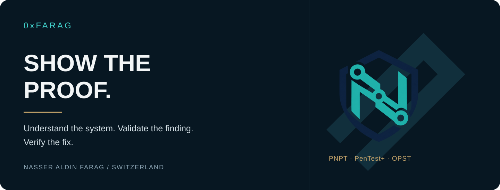

# Nasser Aldin Farag · 0xFarag

**Penetration Testing · Web & API Security · System Engineering**  
Zürich, Switzerland

I bring more than ten years of system engineering experience and a background in web security to practical security assessment. My work follows a clear standard: understand the system, reproduce the finding, explain its impact and verify the fix.

My focus is application security, authorization testing and security automation. I build reproducible working examples that make technical reasoning and remediation inspectable.

[LinkedIn](https://www.linkedin.com/in/nasser-aldin-farag-974697412/) · [GitHub projects](https://github.com/0xFarag?tab=repositories) · [YouTube](https://www.youtube.com/@0xFarag) · [TryHackMe](https://tryhackme.com/p/0xFarag)

## AuthzLedger 0.3.4 pre-release

**An authorization engineering workbench: explicit policy → controlled HTTP tests → explainable evidence.**

**[Open the tool and installation guide →](https://github.com/0xFarag/0xFarag/tree/authzledger-v0.3.4)**

[Source ZIP](https://github.com/0xFarag/0xFarag/raw/refs/heads/authzledger-v0.3.4/release/authzledger-0.3.4-source.zip) · [Installable wheel](https://github.com/0xFarag/0xFarag/raw/refs/heads/authzledger-v0.3.4/release/authzledger-0.3.4-py3-none-any.whl) · [55-second release video](https://github.com/0xFarag/0xFarag/blob/authzledger-v0.3.4/media/AuthzLedger_v0.3.4_Release_wide.mp4) · [Release notes](https://github.com/0xFarag/0xFarag/blob/authzledger-v0.3.4/RELEASE_NOTES.md)

The source-visible distribution, test evidence, downloads and wide/vertical videos are available on the dedicated `authzledger-v0.3.4` branch. Pre-release; all rights reserved. [Earlier 36-second product preview](https://www.youtube.com/shorts/Svr7Jhb_FNc).

A controlled local API returns HTTP 403 while leaking a protected field. The preview follows the failed body check, legitimate-access controls and the same-contract retest: 24 checks pass and one finding is recorded as resolved. Synthetic data; actual Studio captures.

AuthzLedger compiles actor/resource access matrices into checks with positive-control dependencies, traces outcomes to their rules, and keeps proposed policy changes separate from remediation results. Its local fault corpus exercises ownership, tenant and role boundaries, protected data in denial responses, invalid credentials and stale fixtures.

The current pre-release includes a local Studio, an offline OpenAPI importer, a CLI and JSON/HTML/JUnit evidence. Validation uses authored synthetic fixtures; independent customer evaluation and commercial validation are the next gates.

## Selected engineering work

| Project | Purpose | What to inspect |
| :--- | :--- | :--- |
| [**API Authorization Lab**](https://github.com/0xFarag/api-authorization-lab) | Make object-level authorization failures reproducible. | Local invoice API, ownership enforcement and before/after HTTP evidence. |
| [**Nmap Evidence Report**](https://github.com/0xFarag/nmap-evidence-report) | Turn scan output into usable assessment evidence. | Offline XML processing, Markdown/JSON reports and preservation of observed states. |
| [**Pentest Case Study**](https://github.com/0xFarag/pentest-case-study) | Connect a technical finding to a clear remediation decision. | Scope, impact, request/response evidence, fix and retest. |
| [**Offensive Security Labs**](https://github.com/0xFarag/offensive-security-labs) | Explore security boundaries through executable examples. | Exploit/fix pairs across OAuth, SSRF, CI and API security, with regression checks. |
| [**TryHackMe Reports**](https://github.com/0xFarag/tryhackme-writeups) | Document technical reasoning and lessons from completed rooms. | Learning retrospectives, remediation analysis and proposed retest criteria. |

The runnable labs and sample assessment use synthetic data in local environments. They are separate from client engagements. TryHackMe reports distinguish completed learning activities from proposed retests.

## Technical focus

**Web & API security** — HTTP, authentication boundaries, object-level access control, finding validation and retesting.  
**Systems** — Windows/Linux, networking, operations and system engineering.  
**Security engineering** — Python automation, structured evidence, reproducible tests and clear technical reporting.  
**Continuing development** — Active Directory security, offensive security methodology and red teaming.

## Credentials

| Credential | Issuer | Earned |
| :--- | :--- | :--- |
| **PNPT** — Practical Network Penetration Tester | TCM Security | 2024 |
| **PenTest+** | CompTIA | 2024 |
| **OPST** — OSSTMM Professional Security Tester | ISECOM | 2024 |
| **PJPT** | TCM Security | 2023 |
| **eJPT** | INE | 2023 |
| **CC** — Certified in Cybersecurity | ISC² | 2024 |
| **ICCA** — INE Certified Cloud Associate | INE | 2023 |
| **Google Cybersecurity Professional Certificate** | Google | 2023 |

## Work with me

I welcome conversations about penetration testing and application security roles, focused security automation, reproducible edge cases and practical technical collaboration.

**[Contact me on LinkedIn →](https://www.linkedin.com/in/nasser-aldin-farag-974697412/)**

Understand the attack. Prove the finding. Verify the fix.
