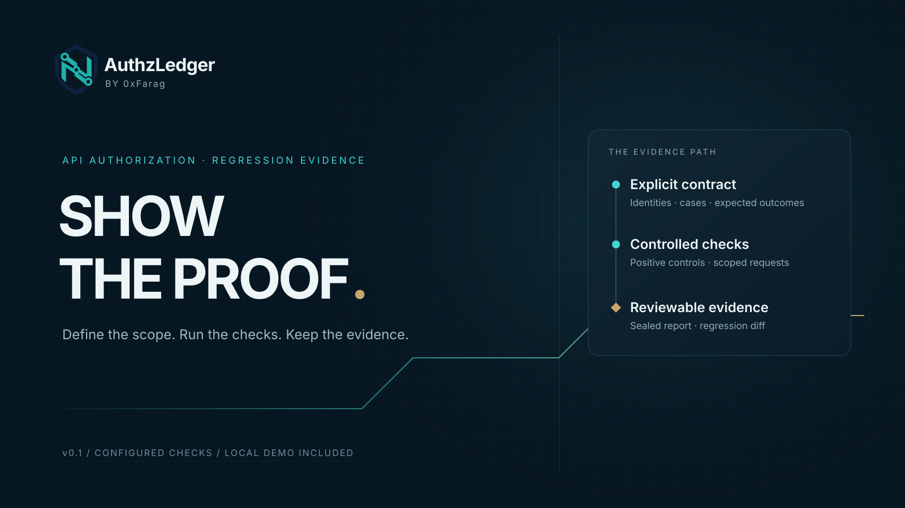

# AuthzLedger

**Explicit access policy. Controlled tests. Explainable retests.**



AuthzLedger is a local authorization engineering workbench. Define an actor/resource access matrix, generate HTTP checks with positive-control dependencies, and trace each result back to its access rule. Compare the same tests after a fix; review policy changes separately so a relaxed permission cannot masquerade as remediation.

The v0.3 local corpus covers four actors, six resources and eight authored scenarios, including ownership, tenant and role bypasses, data leakage in HTTP 403 responses, expired credentials and stale fixtures. [Inspect the engineering evidence and limits](docs/validation.md).

**Status: 0.3.4 pre-release. All rights reserved.** This is a source-visible preview, not an open-source licence. See [rights and permissions](LICENSE) before using or redistributing it. GitHub platform rights remain unaffected.

Copyright © 2026 Nasser Aldin Farag. Applicable statutory and hosting-platform rights remain unaffected. See [NOTICE.txt](NOTICE.txt).

**[Download the source ZIP](https://github.com/0xFarag/0xFarag/raw/refs/heads/authzledger-v0.3.4/release/authzledger-0.3.4-source.zip)** · [Installable wheel](https://github.com/0xFarag/0xFarag/raw/refs/heads/authzledger-v0.3.4/release/authzledger-0.3.4-py3-none-any.whl) · [SHA-256 checksums](release/SHA256SUMS.txt)

**[Watch the 55-second release walkthrough](https://github.com/0xFarag/0xFarag/raw/refs/heads/authzledger-v0.3.4/media/AuthzLedger_v0.3.4_Release_wide.mp4)** · [Vertical video](https://github.com/0xFarag/0xFarag/raw/refs/heads/authzledger-v0.3.4/media/AuthzLedger_v0.3.4_Release_vertical.mp4) · [Release notes](RELEASE_NOTES.md) · [Validation](docs/validation.md)

This distribution is published on the dedicated `authzledger-v0.3.4` branch of `0xFarag/0xFarag`. The profile remains on `main`. [GitHub pre-release and downloadable assets](https://github.com/0xFarag/0xFarag/releases/tag/v0.3.4).

## Start with Studio

Requires Python 3.10 or later. The runtime uses the Python standard library. Linux with CPython 3.12 is the locally verified environment. For a copy you are authorised to use:

```sh
git clone --branch authzledger-v0.3.4 --single-branch https://github.com/0xFarag/0xFarag.git authzledger
cd authzledger
python3 -m authzledger studio --open
```

The default **Access matrix** workspace provides editable permissions, coverage gaps and a rule inspector. Choose **Run eight-scenario lab** for actual local HTTP execution, then inspect each scenario and its control dependencies in **Evidence**. No account, credentials or paid service are required for this local corpus.

For your own authorized API, configure actors/resources, explicitly review each permission, generate the checks and review the exact scope before execution. Credential values stay in environment variables. Save projects and export evidence before stopping Studio; it holds session state in memory. [Matrix guide](docs/matrix.md) · [Studio guide](docs/studio.md).

In Evidence, filter checks by outcome or choose **Needs review** to focus on failures, errors and inconclusive results. Exports always retain the full report. A baseline you select remains pinned when switching lab scenarios.

The offline OpenAPI importer and advanced JSON contract workflow remain available. An optional release wheel supports isolated installation; see [INSTALL.md](INSTALL.md). No sudo, cloud account or runtime package download is needed for the source-tree launch.

## Run the demonstration from the CLI

```sh
python -m authzledger demo --out artifacts/demo
```

The demo starts a loopback-only fixture with synthetic identities and records. It runs one contract against a vulnerable implementation, applies the fixture's corrected authorization behaviour, then runs the same contract again. No remote target or credentials are needed.

Open `artifacts/demo/diff.html` for the comparison, or `artifacts/demo/vulnerable/report.html` and `artifacts/demo/fixed/report.html` for the individual runs. The demo also writes `contract.json`, `plan.json`, `diff.json` and each run's JSON/JUnit evidence.

This is a demonstration of the configured checks against a local fixture, not an assessment of an external service.

## What the workflow provides

| Capability | Behaviour |
| --- | --- |
| Access matrix compiler | Complete declared-pair accounting, explicit unknowns and generated controls. |
| Policy migration review | Distinguish changed permissions/fixtures and removed coverage from actual fixes. |
| Explicit contract | Fixed target, named identities, exact paths and expected outcomes. |
| Local Studio | Guided planning, execution, evidence inspection and retest exports. |
| Offline OpenAPI import | Catalog operations and compile selected cases with explicit fixture values and permissions. |
| Positive controls | Dependent checks execute only after their prerequisites pass. |
| Bounded execution | Request, concurrency, timeout and response-size limits. |
| Evidence bundle | JSON results, standalone HTML and JUnit XML. |
| Retest comparison | Regressions, resolved failures and inconclusive results remain distinct. |
| Integrity verification | Check the report's hashes; optionally compare with a separately trusted anchor. |

## Run a contract

Generate a starter contract for your authorised API origin:

```sh
python -m authzledger init --target http://127.0.0.1:8765 --out authorization.json
```

`init` creates three cases: a successful owner request, a successful request for the other identity's own resource, and a cross-user denial check that requires both controls to pass. It sends no requests and refuses to overwrite an existing file. Replace the placeholder resource paths, add response assertions and adapt the identities using the [contract guide](docs/contract.md). Set the named credential environment variables through your shell or CI secret store, then:

```sh
python -m authzledger plan authorization.json
python -m authzledger run authorization.json --out artifacts/current
python -m authzledger verify artifacts/current/report.json
```

Use an explicitly authorised target and test identities. AuthzLedger executes the contract you supply; it can index operations from a supplied specification but does not discover live endpoints or determine your authority to test them.

Each run writes:

```text
artifacts/current/
  report.json
  report.html
  junit.xml
```

To compare two runs of the same contract:

```sh
python -m authzledger diff artifacts/baseline/report.json artifacts/current/report.json --out artifacts/comparison
```

The comparison writes `diff.json` and `diff.html`.

GET, HEAD and OPTIONS are enabled by default. POST, PUT, PATCH and DELETE require `run --allow-mutations`. Even an otherwise read-only endpoint can have side effects; use controlled test data.

## Interpret the result

| Run exit code | Meaning |
| --- | --- |
| `0` | Every configured case passed. |
| `1` | One or more assertions failed, with no configuration/runtime/inconclusive condition taking precedence. |
| `2` | Configuration problem, runtime error or inconclusive case. |

A pass establishes the configured assertions for that run. Coverage depends on the identities, resources and assertions in the contract. A skipped prerequisite is not a successful access-denial test.

Reports omit response bodies, response headers, resolved credentials and expected/observed assertion values. They retain operational metadata such as the target, paths and case identifiers. Review that metadata before sharing evidence.

## Documentation

- [Access matrix, controls and policy migration](docs/matrix.md)
- [v0.3 engineering review and measured evidence](docs/validation.md)

- [Contract format and examples](docs/contract.md)
- [Studio workflow](docs/studio.md)
- [OpenAPI import and explicit policy](docs/openapi.md)
- [Security model and evidence boundaries](docs/security-model.md)
- [CI integration and retesting](docs/ci.md)
- [Contributing](CONTRIBUTING.md) · [Security reporting](SECURITY.md) · [Rights and permissions](LICENSE)

