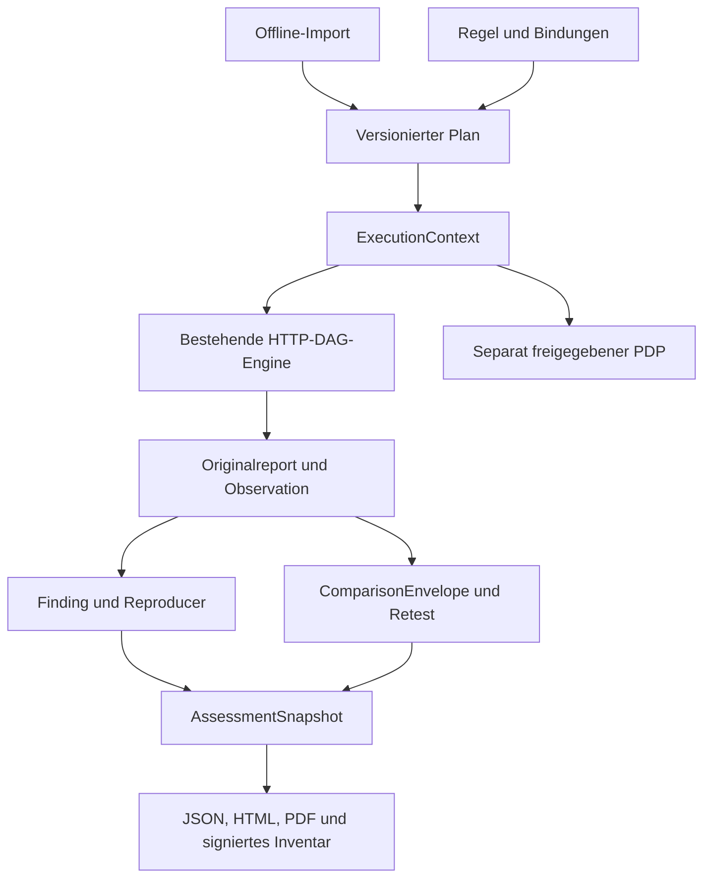

# AuthzLedger 1.1.0 — vom Request zum überprüfbaren Sicherheitsnachweis

Stand: 10. Oktober 2026. Rechte: Nasser Aldin Farag / 0xFarag.

## Produktentscheidung

**AuthzLedger ist die lokale Proof-Workbench für professionelle Pentester.** Ein interessanter Request wird zu einem kontrollierten Experiment, einem nachvollziehbaren Finding, einem belegten Reproducer und einem gezielten Fix-Nachweis. Der Operator behält Scope, Identitäten, Regeln, Mutationen und Requestbudget in der Hand.

Der Wert liegt in der vollständigen Beweiskette: Welche Regel wurde verletzt? Welche Identität und Ressource wurden wirklich geprüft? Waren die Kontrollen gültig? Welche Reduktion reproduziert denselben Verstoss? Was belegt der aktuelle Retest, und was wurde ausgelassen? Jede dieser Fragen muss aus derselben Oberfläche beantwortbar sein.

1.1.0 übernimmt den vollständigen fachlichen Umfang des [verbindlichen 1.0.5-Implementierungsvertrags](implementation-1.0.5.md), einschliesslich aller 88 Abnahmeszenarien. Die neue Minor-Version ersetzt das geplante 1.0.5-Releaseziel. Der Vertrag bleibt als unveränderte Anforderungsbaseline erhalten; Bezeichnungen mit 1.0.5 darin sind keine zusätzlichen oder parallelen Produktziele.

**Status dieses Dokuments:** Releasevertrag und Integrationsbeschreibung. Der integrierte Entwicklungsstand trägt die eindeutige Version `1.1.0.dev0` mit eigenem explizitem Vergleichsprofil. Fertigstellung, tatsächliche Tests und verbleibende Blocker werden im Verifikationsprotokoll geführt. Eine hohe Testzahl allein erklärt nicht sämtliche Anforderungen für erfüllt. Produktionsversion `1.1.0` und öffentliche Releaseaussagen folgen erst dem vollständigen Releasegate.

## Positionierung und unmittelbar spürbarer Wert

Burp und ZAP bleiben die Arbeitsumgebung für Exploration und manuelle Entdeckung. AuthzLedger übernimmt explizit exportierte Requests und macht daraus wiederholbare, überprüfbare Experimente. HAR unterstützt Browser-/API-Abläufe. Die Integration ist lokal und dateibasiert: kein Plugin mit weitreichenden Rechten, kein Hintergrundscan, keine heimliche Übernahme von Browsercookies.

Die Kernversprechen sind messbar:

- Dieselben Eingaben ergeben denselben freigegebenen Plan; keine verborgene Variantenexplosion.
- Ungültige Controls verhindern einen bestätigten Befund und werden im Inspector mit ihrem konkreten Grund sichtbar.
- Jeder akzeptierte Reduktionsschritt besitzt seinen eigenen Nachweis für dieselbe verletzte Regel.
- Teilretests behalten Originalquellen und stellen ausgelassene Fälle ausdrücklich als `not_retested` dar.
- Kunden erhalten dieselben Finding-IDs, Statuswerte und Evidence-Referenzen in JSON, HTML und PDF.
- Der Empfänger kann die Signatur und das vollständige Dateiinventar mit einem separat vertrauten Schlüssel ohne AuthzLedger-Installation prüfen.

Viralität ist ein gewünschter Markteffekt, keine garantierbare Eigenschaft. Teilbar werden überprüfbare Ergebnisse: kurze echte Bildschirmabläufe, synthetische reproduzierbare Labs, messbare Requestzahlen und vollständig nachvollziehbare Pakete. Aussagen über Marktüberlegenheit, universelle Erkennung oder OSCE-Zertifizierung gehören nicht in die Produktversprechen.

## Vollständiger Releaseumfang F01–F08

| Fähigkeit | Fertiger Bedienweg | Nicht verhandelbares Gate |
|---|---|---|
| F01 Import und Zuordnung | Burp-/ZAP-/HAR-Datei wählen; redigierte Operation auswählen; Identität, Ressource und Controls binden | Offline, begrenzt, Herkunft sichtbar; unbekannte oder verlustbehaftete Formate bleiben blockiert |
| F02 Contrast Lab | Explizite Regel und Varianten über Identität/Objekt/Route/Felder planen; Controls und Budget prüfen | 200 mit Fehlerobjekt ist kein BOLA; 403 mit exakt geschütztem Marker kann Datenpreisgabe belegen |
| F03 Workflow Contracts | Isoliertes Objekt anlegen; Vorzustand prüfen; freigegebene Sequenz variieren; Nachzustand unabhängig lesen; Cleanup | Unerlaubter Zustand bzw. zusätzlicher Effekt nachgewiesen; Reset-/Bindungsfehler bleiben inconclusive |
| F04 Minimal Reproducer | Entfernbare Header/Queryvorkommen/JSON-Felder auswählen; Zusatzbudget freigeben; Beweiskette verfolgen | Nur gleiche Regelverletzung mit frischen gültigen Controls akzeptiert; 1-Minimalität ausdrücklich geprüft |
| F05 Selektive Retests | Bestätigte Baseline und Varianten wählen; Control-Closure ansehen; gezielt ausführen | Quellen-/Versionsbindung, Regel-/Identitätsbindung und nicht erneut geprüfte Fälle sichtbar |
| F06 Studio | Import bis Proof in einem Assessment; durchgängige Auswahl, Kontextzeile, Inspector und Befehlspalette | Tastaturbedienung, Revisionsbindung, einmalige Freigabe, idempotenter Start und Job-Reconnect |
| F07 Reports und Proof | Reviewer/Impact/Standards prüfen; Snapshot einfrieren; JSON/HTML/PDF und signiertes Paket exportieren | Gleiche Fachinhalte, escaped HTML, visuell geprüftes PDF, vollständige signierte Dateibindung |
| F08 Graph und Assurance | Änderungen mit Ursache auswählen; abhängige Tests und Controls planen; endliche Assurance ausführen | Unbekannte Abhängigkeiten sichtbar; im Zweifel Vollscope; kein Budgetreset zwischen Zyklen |

P0 bestimmt die Implementierungsfolge, nicht die öffentliche Produktvollständigkeit. F03/F04/F08 sind ebenfalls verbindliche Bestandteile des 1.1.0-Releases.

## Technische Integration

Das bestehende v1-Contract-/Reportformat und die getrennten Graph-Ebenen bleiben erhalten. Neue Fachobjekte sind versionierte Sidecars: ImportBatch, ExperimentPlan, ExperimentExecution, Observation, Finding, WorkflowTrace, WorkflowAssuranceResult, ReductionTrace und AssessmentSnapshot. Sie referenzieren Originalreports und deren Evidence-Roots. Kein alter Report wird umgeschrieben, um einen Vergleich passend zu machen.

### Ein Ausführungskontext

`ExecutionContext` führt Reservationen, freigegebene Origins, Deadline, Parallelität, Cleanup-Reserve und tatsächliche Dispatches unter einem gemeinsamen Lock. Controls, App-Requests, PDP, Setup, Zustandsreads, Replay, Reduktion und Cleanup verbrauchen dasselbe Budget. Ausführungsfehler zählen; implizite Retries und automatische Redirects bleiben aus. Ein Teilcontract oder neuer Assurancezyklus erzeugt keinen neuen Gesamtzähler.

Scope ist nicht bloss ein String im Bericht. Jeder Dispatch wird erneut gegen seinen Zweck und die freigegebene Adresse geprüft. Der App-Origin erlaubt keinen zusätzlichen OPA-Endpunkt. Ein vorab freigegebener Cleanup kann seine reservierten Requests nach einem Stop nutzen; gewöhnliche neue Requests werden gestoppt. Nicht ausgeführte Arbeit erhält einen ausdrücklichen unklaren/nicht ausgeführten Zustand. Bereits gesendete Mutationen werden nicht als rückgängig gemacht dargestellt.

Workflow-Assurance plant eine endliche Zahl von Zyklen mit einem Gesamtbudget und vollständiger Cleanupreserve. Vor jedem Zyklus werden beide Historyketten, deren aktuelle Anker und das erlaubte Alter geprüft. Fixture-Identitäten bleiben über Zyklen und gespeicherte Jobs gebunden; eine umbenannte Regel setzt die Freshness-Prüfung nicht zurück. Verletzung, unklarer Zustand, Cleanupfehler, veränderte History oder Budgetende stoppen weitere Zyklen. Die neue Workflowkette wird additiv gespeichert; bestehende v1-Zeilen bleiben unverändert. Der signierte Snapshot enthält den äusseren Assurance-Nachweis samt Zyklen, Ledger und Historyankern. Ohne konfigurierte dauerhafte History kennzeichnet Studio die History ausdrücklich als sitzungsgebunden.

### Secrets und Beobachtungen

Der Credential-Resolver unterstützt bestehende Umgebungsreferenzen und serverseitige Sitzungswerte. Sitzungswerte werden an Origin und Identität gebunden. Die Oberfläche zeigt Referenz und Verfügbarkeit; Werte werden nicht in LocalStorage, History, Export oder URLs geschrieben. Rohimporte werden nur transient geparst. Unbekannte Secretpositionen bleiben Zuordnungsblocker.

Der bestehende Transport liefert für neue Oracles kurzfristige Response-Captures im Prozessspeicher. Persistiert werden ausschliesslich freigegebene Evidence-Projektionen und ihre Herkunft. Eine Oracle-Neuberechnung ist nur dann als `captured_inputs_replayed` bezeichnet, wenn die dafür benötigten freigegebenen Werte vorliegen. Sonst bleibt die Aussage ausdrücklich `evaluation_attested`. Ein Bodyhash ersetzt keine unabhängige Oracleauswertung.

### Gemeinsame Services

Studio und CLI rufen dieselben Parser, Compiler, Executor-, Vergleichs-, Minimierungs-, Snapshot- und Reportingfunktionen auf. Bewertungslogik liegt ausschliesslich im Domain-Service. Browserzustand entscheidet nicht, ob ein Finding bestätigt oder ein Fix nachgewiesen ist.

Ein Experimentplan enthält den normalisierten Contract, explizite Varianten, Regel-/Normalizer-Digests, Quellenbezüge, Mutationserlaubnisse und Requestobergrenze. Vor Ausführung wird der Plan aus seiner Spezifikation erneut berechnet. Die CLI verlangt seinen exakten Digest; Studio verwendet eine kurzlebige Freigabe, die an den gespeicherten Plan gebunden und vor Dispatch atomar verbraucht wird. Dieselbe Job-Initiierung darf keinen zweiten Lauf erzeugen.

### Vergleich und Fix-Nachweis

ComparisonEnvelope v1 bleibt die Grundlage für den versionsbewussten Vergleich konfigurierter Checks. `resolved_check` allein wird nicht in einen fachlich bestätigten Fix umbenannt. Der Assessmentvergleich prüft zusätzlich dieselbe Regel, Ressource, Identitätsbindung, Oracle-Version und gültige aktuelle Controls. Geänderte Erwartungen oder unbekannte Zuordnung ergeben Nichtvergleichbarkeit bzw. Unklarheit.

Neue Toolprofile werden ausdrücklich registriert und durch Golden-Fixtures geprüft. Es gibt keinen Versions-Wildcard. Historische signierte Pakete bleiben mit ihrer ursprünglichen Prüftiefe verifizierbar.

## Eine Oberfläche, ein Arbeitsobjekt

Die Kontextzeile bleibt über allen Ansichten sichtbar: Assessment, Revision, Ziel, Plan, ausgewählte Entität und Jobzustand. Links liegen fokussierte Arbeitsschritte, in der Mitte die aktuelle Aufgabe, rechts der persistente Inspector. Bei schmalen Fenstern wird der Inspector als zugänglicher Drawer geöffnet. Navy, Gold und klare Statusfarben führen die bestehende Marke fort; Status ist zusätzlich als Text vorhanden.

| Schritt | Primäre Aktion | Inspector beantwortet |
|---|---|---|
| Import | Datei übernehmen und Request auswählen | Woher stammt er? Was wurde entfernt? Welche Daten fehlen? |
| Bindung | Actor, Owner, Ressource, Principal-/Tenantmarker und Controls zuordnen | Welche Werte sind deklariert, welche später unabhängig geprüft? |
| Contrast | Rezept wählen und konkrete Varianten prüfen | Welche Regel, welcher Oracle, welche Abhängigkeiten, wie viele Requests? |
| Ausführung | Exakten Plan freigeben | Welche Controls laufen? Was wurde tatsächlich dispatcht? |
| Untersuchung | Finding in Matrix/Graph auswählen | Welche Originalbeobachtung trägt die Aussage? Was bleibt unklar? |
| Reduktion | Freigegebene Einheiten entfernen lassen | Warum wurde ein Kandidat akzeptiert? Ist Minimalität belegt? |
| Retest | Betroffene Varianten und Controls prüfen | Was ist vergleichbar? Was bleibt historisch und not_retested? |
| Report | Snapshot und Reviewerangaben prüfen | Sind Status, Impact, Standards und Evidence vollständig verbunden? |
| Proof | Paket exportieren und prüfen | Welcher Schlüssel, welches Inventar, welche fachliche Prüftiefe? |

Ctrl/Cmd+K öffnet lokale Befehle passend zur aktuellen Auswahl. Enter öffnet die gewählte Aktion; Escape stellt den vorherigen Fokus wieder her. Kein Tastaturbefehl startet ungefragt Zielverkehr. Historische Auswahl löst keine PDP-Abfrage aus. Reconnect fragt dieselbe Job-ID ab; ein Browserfehler wird nicht als Serverabbruch ausgegeben.

Das Releasegate verlangt vollständige Tastaturbedienbarkeit, sichtbaren Fokus, keine allein farbabhängige Bedeutung, keine horizontale Seitenüberbreite bei 390 Pixeln und überprüfte Interaktionen mit grossen Ergebnismengen. Reaktionszeitziele aus F06-11 werden gemessen und mit Referenzumgebung angegeben; sie werden nicht aus einem einzelnen kleinen Screenshot abgeleitet.

## Tiefe Werkzeugübergabe

Burp HTTP-message XML, ZAP Traditional JSON mit Requests/Responses und HAR 1.2 erhalten jeweils ein festes Parserprofil und eigene Negativfixtures. Eine höhere Toolversion ist kein Beleg für Formatkompatibilität. Echte Exporte werden als Golden-Fixtures mit Tool-/Exportprofil dokumentiert; selbst erstellte XML-/JSON-Dateien allein erfüllen dieses Integrationsgate nicht.

Ein DTD, nicht unterstütztes Encoding, fehlende Nachricht, duplizierte Header, nicht rekonstruierbares Framing oder ein redigiertes benötigtes Feld führen zu einem konkreten Blocker. Der Operator kann eine sichere, explizite Bindung oder unterstützte Exportform wählen. Es erfolgt keine stille Reparatur mit veränderter Requestsemantik.

Die zurückgegebene Reproduktion enthält Methode, freigegebenen Pfad, minimale Felder, Secretreferenzen, erforderliche Controls und dieselbe Regel. Sie muss mit frischen Credentials reproduzierbar sein. Ein bloss gekürzter Request ohne frischen Verstossnachweis darf nicht als Minimal Reproducer exportiert werden.

## Reporting und Signaturen

Der Snapshot fixiert Originalausführungen, Findings, Retests, Workflow-/Reduktionsbelege, Scope, Grenzen und Reviewerangaben. JSON, HTML und PDF werden daraus deterministisch erzeugt. Die Paketsignatur bindet die tatsächlich exportierten Bytes aller Formate.

ASVS 5.0.0, WSTG 4.2 und API Security Top 10 2023 werden als versionierte Referenzen mit Bezug, Begründung und konkreter Evidence geführt. Einzelne Tests begründen keine vollständige Standardkonformität. CVSS 4.0 verwendet einen nachvollziehbaren Analystenvektor; technische Schwere, Beweisqualität und geschäftliches Risiko bleiben getrennt. Ein fehlender validierter Score bleibt `not_scored`.

PDF wird lokal mit dem gepinnten Reports-Extra und gebündelter lizenzierter Unicode-Schrift erzeugt. Ein fehlender Renderer blockiert den PDF-Export sichtbar. Das Releasegate umfasst Seitenrendering, lange Findingtitel/URLs, Unicode, mindestens 50 Findings und gleiche fachliche IDs in allen Formaten.

Das bestehende Standalone-Werkzeug prüft Signatur, Inventar, Dateihashes und Reportanker gegen einen extern vertrauten Public Key. Die Hauptanwendung prüft zusätzlich die fachlichen Verbindungen und abgeleiteten Berichte. Ein mitgelieferter Public Key allein begründet kein unabhängiges Vertrauen. Keine der beiden Prüfungen behauptet, den entfernten Server selbst authentifiziert oder die entfernte Ausführung unabhängig beobachtet zu haben.

## Drei reproduzierbare Beweisdemonstrationen

### A: Burp zu Finding und Reproducer

Eine synthetische API stellt zwei Identitäten und getrennte Objekte bereit. Ein unterstützter Burp-Export enthält den interessanten Cross-Tenant-Request mit mehreren irrelevanten Feldern. Import zeigt Herkunft und Secretstellen. Die Regel verbietet den konkreten Objektmarker für Tenant B; Identity-, Owner- und Denial-Controls werden sichtbar geprüft.

Der verletzliche Modus liefert denselben Marker. Das bestätigte Finding führt direkt zur Reduktion. Jeder akzeptierte Kandidat zeigt seine erneute Verletzung mit gültigen Controls. Ein sicherer 200-Fehlerobjekt-Modus erzeugt keinen BOLA-Befund. Ein absichtlich verkürztes Budget demonstriert ehrlich „reduziert, Minimalität nicht bestätigt“.

Teilbare Ausgabe: kurzer ungeschnittener Bedienablauf, redigierter Import, Originalplan, Reduktionskette und verifiziertes Paket. Gemessen werden aktive Bedienzeit, tatsächlich gesendete Requests und akzeptierte entfernte Einheiten; keine ausgedachten Zeitgewinne.

### B: 403-Leakage und ungültige Controls

Derselbe Request liefert 403 und den exakt geschützten Marker. Trotz scheinbarer Ablehnung bestätigt der fachliche Oracle die Preisgabe. Anschliessend wird ausschliesslich die Actor-Credentialbindung ungültig gemacht. Die UI muss den vorherigen Befund als historisch belassen und den neuen Versuch als inconclusive ausweisen. Ein 200 ohne den Marker wird als weiterer Gegenbeweis gezeigt.

Teilbare Ausgabe: drei nebeneinander nachvollziehbare Fälle mit Statuscode, Controlgültigkeit und fachlicher Bewertung. Der Effekt entsteht durch Präzision: Der Zuschauer kann unmittelbar erkennen, warum eine statusbasierte Interpretation falsch wäre.

### C: Gezielter Retest und unabhängige Übergabe

Eine vollständige Baseline enthält mehrere Regeln/Varianten. Nach einer gezielten Korrektur wird nur die betroffene Variante samt Controls ausgeführt. Die Oberfläche zeigt die tatsächliche Ersparnis und sämtliche ausgelassenen Fälle als not_retested. Der Vergleich bewahrt beide Originalroots.

Der Snapshot erzeugt JSON, HTML, PDF und ein signiertes Paket. Ein isolierter Prozess ohne AuthzLedger-Import prüft dessen Integrität. Danach wird genau ein Byte einer Berichtsdatei verändert; die Prüfung muss scheitern. Die Hauptanwendung prüft zusätzlich fachliche Verbindungen. Die Demo zeigt die unterschiedlichen Prüftiefen ausdrücklich.

Als eigener Abschnitt dieser Demonstration wird ein Workflow geprüft: Create → ausgelassene Freigabe → Abschluss → unabhängiger Read sowie derselbe Idempotency-Key zweimal. Erst ein verbotener Zustand bzw. ein zusätzlicher Effekt zählt als Workflowverletzung. Sicherer und verletzlicher Modus sind beide enthalten.

## Sofortiger Implementierungs- und Releaseplan

1. **Integrationsverträge einfrieren.** Bestehender Vergleich bleibt die geprüfte Basis. Plan-/Trace-/Snapshotfelder und Eigentümer je Modul festlegen; Golden-v1-Artefakte sichern. Kein Frameworkwechsel und keine zweite HTTP-Engine.
2. **Gemeinsamen Ausführungspfad schliessen.** Budget, Cancellation, Credentials, Observation-Sink und PDP anschliessen. Konkurrenztests, fehlgeschlagene Requests, Cleanupreserve und Mehrzyklusbudget sind blockierende Gates.
3. **Erste vollständige Vertikale liefern.** Unterstützter Burp-Import → explizite Zuordnung → Contrast → gültige Controls → Finding → Inspector. ZAP/HAR anhand ihrer jeweiligen echten Exporte vervollständigen.
4. **Beweiskette vollständig machen.** Workflowisolation, Replayeffekt und Reduktion; selektiver Retest mit stabilen Bindungen; Findings und Originale im Snapshot zusammenführen. Neue Oracles erhalten sichere, verletzliche und unklare Gegenfixtures.
5. **Studio und Übergabe abnehmen.** Gemeinsame Services in UI und CLI; Befehlspalette, Fokus, Revisionen, Doppelklick/Disconnect/Cancel. HTML/PDF/JSON-Parität, Signaturen und unabhängige Verifikation.
6. **Release exakt am geprüften Commit bauen.** Sämtliche 88 Szenarien auf reale Tests/Artefakte abbilden. Vollständige Regression, drei Demos, Browserabnahme, Wheel-Installation ausserhalb des Repositories, Upgrade-/Rollbackprobe und Offlineverifikation ausführen.
7. **1.1.0 veröffentlichen.** Erst nach grünen Gates Versionsmetadaten, Vergleichsprofil und Releasehinweise setzen; erneut das exakte Distributionsartefakt prüfen. Source, Wheel, Standalone-Verifier, Prüfsummen und reproduzierbare Lab-Anleitung veröffentlichen. v1.0.0-Tag und Assets bleiben erhalten.

Ein einzelner offener Befund zu Secretleck, Budgetumgehung, ungültig bestätigtem Finding, falschem Fixstatus, Originalüberschreibung oder nicht prüfbarem Report blockiert den Release. Fehlende echte Toolfixtures, ungetestete GUI-Schritte und nicht gemessene Leistungsanforderungen werden als offene Abnahmen geführt. Sie dürfen nicht durch eine Versionsänderung verdeckt werden.
